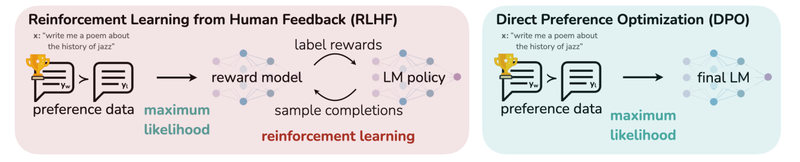

### Direct Preference Optimization: Your Language Model is Secretly a Reward Model

论文链接：https://arxiv.org/abs/2305.18290

**背景**：

主流对齐方法RLHF流程非常复杂且不稳定，主要存在以下问题：

- 流程繁琐：标准的 RLHF 需要三个阶段：
  1. 监督微调 (SFT)。
  2. **训练奖励模型 (Reward Model)**：专门训练一个模型来给回答打分。
  3. **强化学习微调 (RL Fine-tuning)**：使用 PPO 等算法，让语言模型在“获得高分”和“不偏离原始模型”之间找平衡。
- **计算成本高**：训练过程中需要同时维护多个模型（策略模型、参考模型、奖励模型，有时还有价值模型），并且在训练循环中需要不断从语言模型中采样，显存占用大，训练速度慢。
- **超参数敏感且不稳定**：PPO 算法有很多超参数需要调节，训练过程容易崩溃或不收敛，复现难度大。

能不能跳过强化学习，**直接利用偏好数据优化语言模型**？

**解决方案**：

作者从数学上证明了，求解RLHF的目标函数的最优解等价优化于以下的DPO损失函数：
$$
L(\pi_\theta, \pi_{\text{ref}}) = - \mathbb{E}_{(x, y_w, y_l) \sim \mathcal{D}} \left[ \log\sigma \left( \beta \log \frac{\pi_\theta(y_w \mid x)}{\pi_{\text{ref}}(y_w \mid x)} - \beta \log \frac{\pi_\theta(y_l \mid x)}{\pi_{\text{ref}}(y_l \mid x)} \right) \right]
$$
DPO 把“强化学习问题”转化为了一个“监督学习问题”。你只需要准备**偏好数据集（Prompt, 好回答, 坏回答）**，然后用标准的梯度下降法直接更新语言模型即可，不需要采样，不需要奖励模型，也不需要复杂的 PPO 算法。

训练过程中，对于偏好回答，相比参考模型，模型会增加生成的概率；对于拒绝回答，相比参考模型，模型会降低生成的概率。

**数据质量比数量更重要（尤其是“坏”样本）**

DPO的损失函数依赖于偏好数据对，如果坏回答其实并不坏，或者说reject和chosen区别不大，模型会学到错误的信号，导致性能下降。使用**高质量、区分度大**的偏好数据，即使数量较少，效果也优于大量低质量数据

**✅DPO的优点**

+ 隐式奖励模型：**语言模型本身就可以被视为一个奖励模型**。通过特定的参数化形式，语言模型的输出概率比值直接对应了奖励值的差值。这使得我们可以绕过显式的奖励建模。

+ 工程上极简与稳定

  + 离线数据，**训练时不需要像 PPO 那样在循环中生成文本**，大大降低了计算开销。

  + 省去了**训练和维护额外奖励模型**的步骤。

  + 主要**只需要调节一个 $\beta$ 参数**（控制偏离程度），比 PPO 那一堆超参数好调得多。

    >$\beta$ 通常在0.1到0.5之间，它控制着模型偏离参考模型的程度。
    >
    >+ $\beta$ 趋近于0时，模型会疯狂拟合偏好数据，可能导致过拟合，生成内容多样性下降，甚至出现“奖励黑客”（Reward Hacking，即为了得高分说胡话）
    >+ $\beta$趋近于无穷时，模型完全不敢动，退化为原始的SFT模型。

  + 作为一个标准的分类损失，**训练过程非常稳定**，不容易崩溃。

+ 性能表现优异

**❌DPO的缺点**

+ 泛化能力弱（OOD表现差）：对于**训练分布之外**的数据，DPO缺乏独立的奖励模型来进行合理的泛化评估。它容易**在未见过的区域产生错误的过高奖励估计，导致生成质量下降或不可控**。 [DPO is not all you need](https://arxiv.org/abs/2312.10584/)

  >**DPO的损失函数**只关心**成对数据的相对大小**：它只要求 $P(y_w)>P(y_l)$
  >
  >它并不像训练奖励模型（Reward Model）那样，试图学习一个绝对的分数 $R(x,y)$，使得所有可能的$y$都有一个合理的打分
  >
  >**问题所在**：如果数据集中只有“短回答”和“长回答”的对比，且长回答总是被选为 $y_w$ 。DPO会拼命提升长回答的概率。对于那些**数据集中从未出现过的中等长度或特殊结构的回答**，由于损失函数没有显式地惩罚它们（因为它们不在batch里，不参与梯度更新），模型为了最大化似然，可能会将这些“未知区域”的概率质量（Probability Mass）错误地转移，或者因为参考模型（Reference Model）在这些区域的概率极低，导致计算出的隐式奖励值异常高。

+ 对数据偏差（Bias）极度敏感：DPO是**直接拟合数据分布**，数据里有什么bias，它就学什么，没有奖励模型那种“去噪”或“抽象概括”的过程。

+ 依赖高质量的SFT初始化：DPO本质上是在SFT模型附近做局部搜索。如果SFT模型本身能力很差（比如不懂基本常识），DPO很难通过偏好数据将其“拉回”正轨，因为它缺乏全局探索能力（Exploration）。

+ 无法在线迭代：标准DPO是离线的。它不能像PPO那样在训练过程中生成新样本、获取新反馈、再更新模型。这限制了它在动态环境或需要不断自我进化场景中的应用。[DriveDPO: Policy Learning via Safety DPO For End-to-End Autonomous Driving](https://arxiv.org/abs/2509.17940) 提到了如何通过多轮迭代来模拟在线学习

+ 隐式奖励的不可解释性：你无法像查看奖励模型那样，直接拿出一个DPO模型的“奖励分数”来分析它为什么喜欢某个回答。奖励隐藏在参数里，调试困难。

**如何应对这些缺点**：

1. **数据清洗与平衡**：专门针对长度、风格进行数据重加权（Re-weighting）或构造对抗样本，消除Bias。
2. **Iterative DPO (迭代DPO)**：用当前模型生成新数据，再用人工或强模型标注，重新训练DPO，模拟在线学习，缓解OOD问题。
3. **混合架构**：使用一个轻量级的奖励模型来过滤DPO的训练数据，或者在DPO loss中加入显式的奖励模型正则项。
4. **改进算法**：提及 **IPO** (Identity Preference Optimization, 更稳健的正则化) 或 **KTO** (处理非成对数据)，以及 **SimPO** (Simple Preference Optimization, 去除参考模型，直接优化边际奖励，解决参考模型依赖问题)。

DPO的**正向挤压**

在DPO的损失函数中，目标是最大化优选回答 $y_w$ 的概率，同时最小化劣选回答 $y_l$的概率。为了降低 Loss，模型必须拉大两者之间的概率比值。

**“挤压”现象**：由于概率总和必须为1，当你强行提高 $y_w$ 的概率时，模型必须从其他所有可能的回答（包括$y_l$和其他未出现在数据集中的回答$y_{other}$）中“挤”出概率质量给它。“正向”是指单向地推动概率流向$y_w$，而没有显式地告诉模型“其他未看到的回答应该保持多少概率”

“正向挤压”描述了DPO如何通过局部数据的优化，**扭曲了全局概率分布**。它把概率质量从“未知区域”强行搬运到了“已知优选区域”，导致模型对未知区域的判断失效（泛化性差），是OOD问题的核心原因之一

DPO用于**分类问题** （继续完善。。。Qwen-DPO）

适用的场景：

+ 只有相对偏好，没有绝对标签（如情感分析 A比B更正面）
+ 类别边界模糊，存在“软偏好”（如医疗诊断 症状X可能是疾病A也可能是疾病B，专家倾向于A）
+ 对抗鲁棒性提升（分类器对干净样本的置信度远高于对抗扰动样本）

潜在的问题：

+ 参考模型的选择
+ 多类别问题
+ “挤压”效应再分类中的表现

