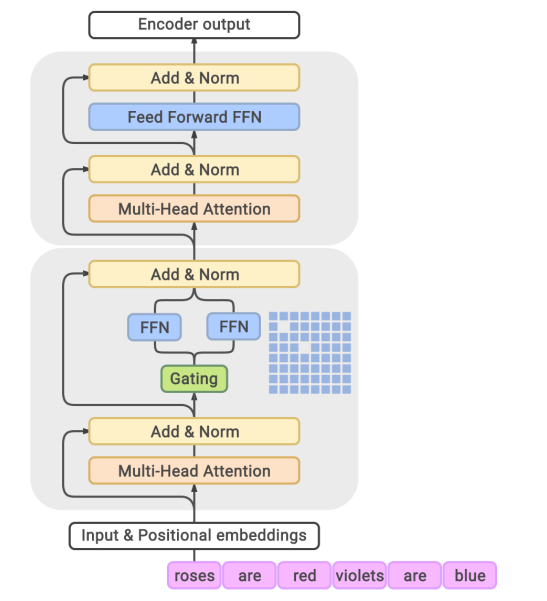

### GLaM: Efficient Scaling of Language Models with Mixture-of-Experts

论文链接：https://arxiv.org/abs/2112.06905

##### 背景：

GPT-3证明了<u>巨大稠密模型</u>在<u>小样本学习</u>上的能力。那么能否构建一个**性能上媲美甚至超越**GPT-3，但在**训练和推理的计算成本远低**于对方的模型呢

---

**Few-shot learning/In-context Learning**：通过给模型提供一个精心设计的**提示（Prompt）**来“指导”它完成任务。这个提示通常包含了任务描述和几个示例（shots）。模型通过**理解提示中的上下文**来完成任务，而不是通过梯度下降来改变自身参数。

---

GLaM 的核心目标是：**用 MoE 架构来挑战“规模定律”，证明稀疏模型是一条更高效、更绿色的通往通用人工智能的道路。**

##### 解决方案：

GLaM 的核心架构继承并发展了 [Switch Transformer](https://arxiv.org/abs/2101.03961) 的思想，但做了一些关键的调整和改进。

**Top-2路由**：GLaM 的路由器会为每个 token **选择概率最高的 2 个专家**。然后，将这两个专家的输出进行加权求和（权重由路由器的 softmax 概率决定）。两个专家比选择一个能提供更强的模型能力和更稳定的训练，同时计算和通信开销的增加仍在可控范围内。

**混合层结构(Hybrid Layer Structure)**：GLaM 并不是将 Transformer 的每一个 FFN 层都替换成 MoE 层。相反，它采用了**交错**的方式：**一个标准的 Transformer 层，跟着一个 MoE 层，如此循环**。在不显著增加模型复杂度和通信开销的情况下，有效地扩大模型容量。

---

**模型容量（Model Capacity）** 是一个比“参数量”更广义的概念，它指的是模型**学习和表示复杂函数的能力**。通常情况下，参数量是提升模型容量最直接的方式。

**MoE 层的“组合爆炸”效应**

- 在一个 MoE 层中，假设有 64 个专家，路由器会选择 Top-2。这意味着对于一个 token，有 C(64, 2) = (64 * 63) / 2 = 2016 种可能的专家组合。这相当于模型在这一层拥有 **2016 条不同的计算路径**。
- 在一个标准的 FFN 层中，只有 **1 条固定的计算路径**。

**为什么用混合层结构，而不是简单地堆叠更多层？**

1. **方案 A (纯堆叠)**：堆叠 64 个标准的 Transformer 层。

   只有**一条固定的计算路径**。所有 token 都必须走这条路。要增加容量，只能把这条路修得更“宽”（增加隐藏层维度）或更“长”（增加层数），这会直接增加每个 token 的计算成本

2. **方案 B (混合结构 - GLaM 的方式)**：堆叠 32 个标准 Transformer 层和 32 个 MoE 层，交错排列。

   模型在 32 个 MoE 层中，每一层都有上千种计算路径可供选择。对于一个输入序列，不同的 token 可能会在不同的 MoE 层选择不同的专家组合。这使得模型拥有**指数级增长的潜在计算路径**

**为什么不全用 MoE 层？**

1. **通信开销**：每个 MoE 层都需要在设备间进行 token 的分发和收集（All-to-All communication），这是非常耗时的。全用 MoE 层会导致通信瓶颈。
2. **参数共享**：标准的 Transformer 层（尤其是自注意力层）负责在 token 之间整合和传递信息，而 MoE 层则更侧重于提供丰富的、专门化的知识（可以理解为大规模的键值记忆）。将两者结合，可以让模型既能进行全局信息交互，又能访问海量的专业知识。
3. **训练稳定性**：过多的路由决策点可能会增加训练的不稳定性。

---

**参数量与计算量解耦**

最大的 GLaM 模型拥有 **1.2 万亿（Trillion）参数**，是 GPT-3（175B）的 **7 倍**。

- 每个 MoE 层包含 64 个专家。
- 尽管总参数量巨大，但由于采用了稀疏激活（Top-2），每个 token 在前向传播时只激活了约 **970 亿（96.6B）参数**，这个计算量级的模型远小于 GPT-3。

**数据质量比数据数量更重要**：没有直接使用未经处理的网页数据而是构建了一个高质量的、经过筛选和混合的数据集（1.6 万亿 token）