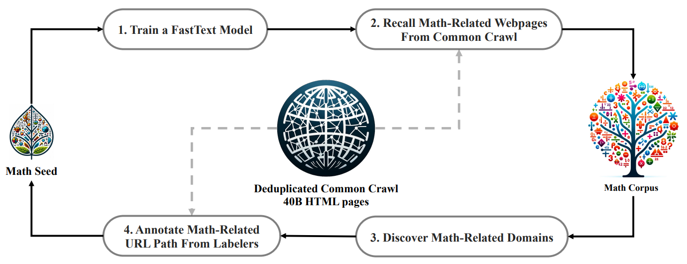
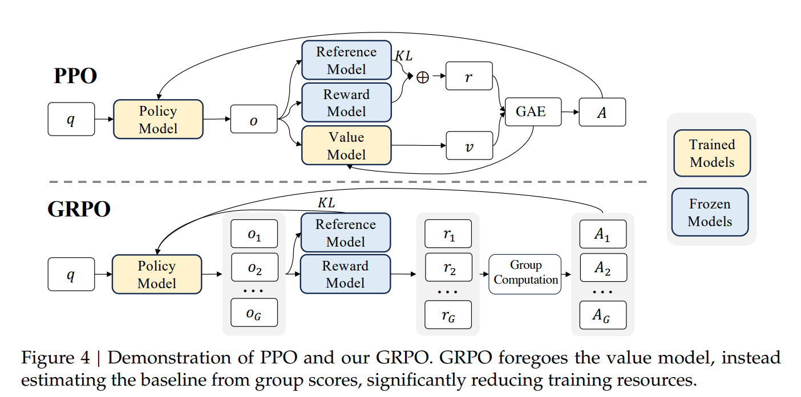
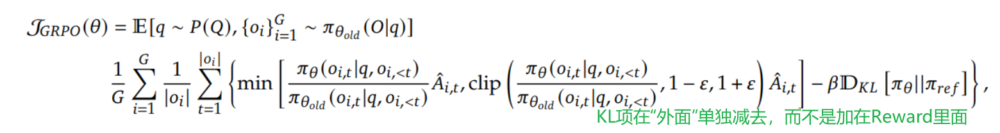
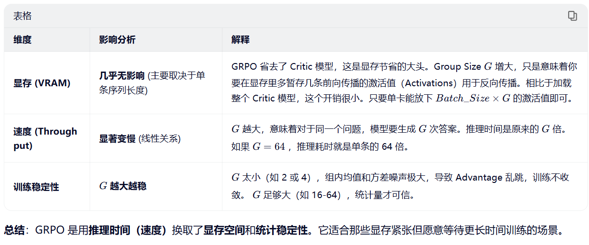

### DeepSeekMath: Pushing the Limits of Mathematical Reasoning in Open Language Models
论文链接：https://arxiv.org/abs/2402.03300

**背景**：

尽管开源模型在通用任务上进步巨大，但在**高难度数学推理**（如竞赛级数学题 MATH 基准）上，开源模型与 GPT-4、Gemini-Ultra 等闭源模型仍有显著差距。具体痛点包括：

- **数据质量与规模瓶颈**：现有的开源数学训练数据（如 arXiv 论文、OpenWebMath）要么规模太小，要么质量不足以支撑小模型达到顶尖水平。特别是 arXiv 数据对提升推理能力的有效性存疑。
- **强化学习（RL）的成本与效率**：传统的 PPO 算法在训练大语言模型时需要额外的 Critic 模型（价值模型），这带来了巨大的显存和计算开销，且训练不稳定。
- **代码与推理的关系**：社区长期猜测“代码训练能否提升推理能力”，但缺乏系统性的实证研究，特别是在数学领域。

**解决方案**：

作者通过**数据工程**和**算法创新**两个方面，使一个7B参数的模型达到了接近GPT-4的数学水平

**数据层面**：构建高质量的DeepSeekMath Corpus

**算法层面**：提出 **GRPO(Group Relative Policy Optimization)**

GRPO旨在解决 PPO 效率低的问题。

+ **去掉 Critic 模型**：PPO 需要一个与 Policy 模型同样大小的 Value Model 来估算基线（Baseline），这非常消耗显存。

+ **组内相对优势估计**：直接用**同一个问题在旧策略下采样的一组输出**的奖励分数的**均值和标准差**来归一化，计算每个输出的相对优势（Advantage），不再需要单独训练 Value Model 来预测基线
  $$
  A_i = \frac{r_i-mean(group_rewards)}{std(group_rewards)}
  $$

在大幅减少显存占用（省去了一个模型）的同时，实现了比 PPO 更稳定的训练和更好的性能提升。

- **对比 PPO**：PPO 需要 Actor + Critic 两个模型，且计算复杂。GRPO **完全去除了 Critic 模型**，利用“组内采样”的统计特性来计算 Advantage。这不仅节省了约 50% 的显存（少加载一个大模型），还简化了训练流程。

- **对比 DPO**：DPO 是离线偏好优化，不需要采样。GRPO 是在线 RL，能通过不断采样探索新解空间，实验证明在线采样（Online Sampling）比离线数据（如 DPO/RFT 使用的静态数据）在后期训练中效果更好。

GRPO 的目标函数不仅包含 PPO 式的 Clipping 项，还显式地加入了 **KL 散度惩罚项**，且**处理方式与 PPO 不同**：

+ PPO**将KL惩罚加在Reward里面** $r' = r- \beta \cdot KL$， 这意味着计算Advantage($A=r'-V$)时，基线$V$和$r'$都包含了KL信息，导致Critic模型不仅要拟合环境奖励，还要**拟合KL散度的变化**，增加学习难度和不稳定性。

+ GRPO直接在Loss末尾减去$\beta \cdot KL$强行限制策略更新的步长 Advantage计算：$\hat{A}_t = \frac{r_t - \mu}{\sigma}$， $r_i$是纯粹的任务奖励，**不掺杂答案有没有偏离参考模型**，使得$\hat{A}_t $是一个无偏的任务质量评估。这种解耦的设计比PPO的混合更稳定和清晰。

**适用场景**：非常适合**资源受限但需要高性能 RL 微调**的场景，特别是数学、代码、逻辑推理等有**明确验证信号**（Verifiable Rewards）的任务。

**✅GRPO的优点**

+ **极致的显存效率**：完全去除了 **Critic Model (Value Model)**
+ **训练稳定性**：
  + **避免价值估计误差**：在 LLM 生成任务中，只有最后一个 token 有明确的奖励（如答案对错），中间 token 的价值很难准确估计。**Critic 模型往往难以收敛或估计偏差大**。GRPO 通过**组内差分**，天然消除了这种“基线估计不准”带来的噪声。
  + **相对评估更符合直觉**：奖励模型本身是基于“对比”训练的（Pairwise），GRPO 的组内相对优势与奖励模型的底层逻辑更契合。
+ **超参数更少**：只需关注 Group Size, Clip range和KL系数
+ **性能优异**

**❌GRPO的缺点**

+ **对 Batch Size (Group Size) 的依赖**
  + **统计噪声**：GRPO 的优势计算依赖于组内统计量（均值和标准差）。如果 Group Size太小（例如 G<4），统计量会有很大噪声，导致优势估计不准，训练震荡。
  + **计算开销权衡**：虽然省了显存，但为了获得稳定的统计量，需要一次性采样多个输出（论文用了 G=64）。这意味着**推理吞吐量**要求较高。如果显存够大但计算速度慢，采样 64 条数据的时间成本会增加。
+ **仅适用于可并行的环境**：PPO 可以在单条轨迹上通过 GAE 计算优势。GRPO 必须同时拥有同一问题的多个不同解才能计算相对优势。这在某些无法大规模并行采样的场景下（如极度受限的推理引擎）可能不如 PPO 灵活。
+ **对 Reward Model 的质量敏感**：虽然所有 RL 都依赖 RM，但 GRPO 是纯粹的“相对排序”。如果 Reward Model 区分度不够（即好答案和坏答案打分差不多），组内标准差$\sigma$会趋近于0，导致优势值爆炸或不稳定。
+ **主要提升 Maj@K 而非 Pass@K**：RL (包括 GRPO) 主要提升了 **Maj@K** (多数投票准确率)，即让模型输出的分布更集中在正确答案上，变得更“稳健”。但在 **Pass@K** (只要有一个对就算对) 上提升不明显。这意味着 GRPO 更多是在**对齐分布**，而不是大幅扩展模型的能力边界（Capability Boundary）。

**GRPO 的 Group Size (G) 对显存和速度的影响关系？**

**Reference Model 是保持不变还是会有所变化？哪一种更好？**

**在 GRPO 及类似的 Online RL 中，定期更新 Reference Model 通常更好；而在 DPO 等 Offline 方法中，通常保持不变。**

Online RL 的目标是**让策略不断进化**。如果 Reference Model 一直是最初的 SFT 模型，随着 Policy 越来越强，它与 Ref 的 KL 散度会越来越大。为了维持同样的 KL 惩罚力度， $\beta$ 需要动态调整，否则策略会被死死锁在初始状态附近，无法探索新的解空间（即“学不动了”）。

DPO (Offline Preference Optimization)是基于静态数据集训练的。它的数学推导依赖于 $\pi_{ref}$是固定的这一假设，这样才能将隐式的 Reward 建模转化为显式的分类损失。如果在训练中途更换，损失函数的含义就变了，可能导致优化目标不一致。