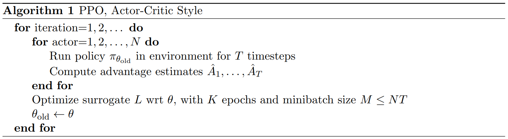

### Proximal Policy Optimization Algorithms

论文链接：https://arxiv.org/abs/1707.06347

**背景**：

在 PPO 出现之前，主流的策略梯度算法（如 TRPO 或普通的 Policy Gradient）有两个极端问题：

1. **步子迈太大（更新幅度不可控）**：
   - 强化学习通过“试错”来学习。如果模型发现某句话能得高分，它可能会**剧烈地**调整参数，以后只说这句话。
   - 后果：在大模型中，这会导致**灾难性遗忘**。模型为了讨好奖励模型，突然不会说人话了，或者陷入死循环（例如一直重复“谢谢谢谢谢谢”因为这样得分高）。
2. **步子迈太小（采样效率低）**：
   - 为了保证安全，以前的算法（如 TRPO）限制非常严格，导致训练极慢，需要海量数据。

**解决方案**：

**PPO 的核心目标**：在**“大胆尝试新策略”**和**“不要偏离旧策略太远”**之间找到一个完美的平衡点。它通过**截断机制(Clipping Mechanism)**简单而巧妙地实现这个目标。

PPO关注**新旧策略的概率比值**
$$
r_t(\theta) = \frac{新模型生成这个词的概率}{旧模型生成这个词的概率}
$$

+ $r_t=1$时：新旧模型一样
+ $r_t=2$时：新模型生成这个词的概率是旧模型的 2 倍（变得更喜欢这个词了）。
+ $r_t=0.5$时：新模型生成这个词的概率减半（变得更不喜欢了）。

不使用截断时，当RM给某个回答打了高分，算法会尽力增大$r_t$，让新模型无限倾向生成这个词（模型参数剧烈震荡，遗忘/破坏原本学到的语言规律）

**截断**操作强制规定**$r_t$只能在$[1-\epsilon,1+\epsilon]（通常\epsilon=0.2）$的范围内起作用**

**PPO的损失函数**
$$
L^{\text{CLIP}}(\theta) = \mathbb{E}_t \left[ \min \left( r_t(\theta) \cdot A_t,\ \text{clip}\left(r_t(\theta), 1-\epsilon, 1+\epsilon\right) \cdot A_t \right) \right]
$$

$$
Loss = PPO_{Loss}-\beta \cdot KL(\pi_{new}, \pi_{ref})
$$

> KL 散度（Kullback-Leibler Divergence）不是真正的“距离”，但它衡量了**两个概率分布有多不像**。
>
> - 如果 KL(A,B)=0 ：分布 A 和 B 完全一样。
> - 如果 KL(A,B)很大：A 和 B 差别巨大。
>
> 在RL中引入KL Penalty用来约束模型不要偏离初始的 SFT 模型太远

**PPO的优缺点**

| 优点                                                         | 缺点                                                         |
| ------------------------------------------------------------ | ------------------------------------------------------------ |
| **稳定性高**：Clipping 机制防止了策略更新过大，训练不易崩溃。 | **超参数敏感**：Learning rate, KL coefficient, Clip range 等需要精细调优。 |
| **样本效率尚可**：支持 Epochs 复用数据，比一些 On-policy 算法效率高。 | **显存占用巨大**：需要同时加载 4 个模型，对大模型（7B+）训练硬件要求极高。 |
| **实现相对简单**：相比 TRPO 的二阶优化，PPO 只需一阶梯度，易于工程落地。 | **容易陷入局部最优**：如果 Reward Model 有缺陷，PPO 会很快学会“钻空子”（Reward Hacking）。 |
| **效果好**：目前对齐人类偏好最成熟的算法之一。               | **训练慢**：需要不断滚动生成数据，无法像离线算法那样预先准备好所有数据。 |

**调试直觉**

+ 如果训练时 Reward 飙升但生成的文本变乱码/重复 → **KL 系数太小** 或 **Clip 范围太大**。

- 如果训练很久 Reward 都不涨 →**学习率太低** 或 **Clip 范围太小**（模型不敢学）。
- 如果出现 PPO-ptx → 在 PPO 损失外挂了预训练损失，为了防止遗忘。