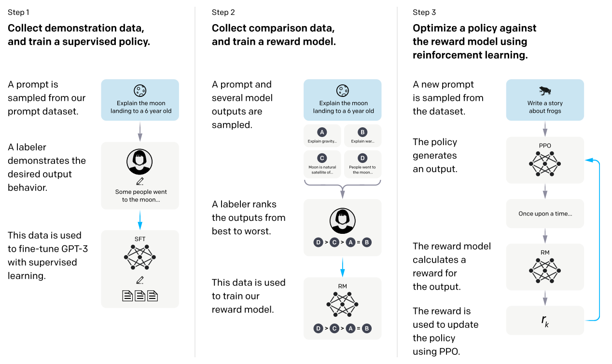

### Training language models to follow instructions with human feedback

论文链接：https://proceedings.neurips.cc/paper_files/paper/2022/file/b1efde53be364a73914f58805a001731-Paper-Conference.pdf

**背景**：

当前大型语言模型（LLM）存在的一个核心问题：**模型目标与用户意图不一致（Misalignment）**。

具体表现：模型并不擅长遵循用户的指令，经常生成不真实、有毒、有偏见或者对用户没有帮助的内容。

根本原因：传统的语言模型训练目标是“**预测下一个词**”（基于互联网文本），这与用户想要的“有用、诚实、无害地**遵循指令**”这一目标是不匹配的。

**解决方案**：作者提出使用**基于人类反馈的强化学习**(Reinforcement Learning from Human Feedback, RLHF)对base model进行微调，得到的InstructGPT在遵循人类偏好方面，表现超过了参数量大100倍的GPT-3模型。



1. 收集示范数据并训练监督策略（Supervised Fine-Tuning, SFT）

2. 收集比较数据并训练奖励模型（Reward Modeling, RM）

3. 利用强化学习优化策略（PPO）

   > 通常微调会损害模型在公共 NLP 数据集上的通用性能。作者通过在强化学习中混合预训练数据（PPO-ptx），在保持对人类指令高度遵循的同时，最小化了在传统 NLP 任务上的性能下降。 


**PPO-ptx**

**标准的 PPO 强化学习只优化一个目标：**最大化奖励模型（RM）给出的分数**。这会导致模型过度优化（Over-optimization），为了骗取高分而生成奇怪的内容，或者丢失预训练时学到的通用语言知识（如语法、事实性知识、代码能力等）。

**PPO-ptx** 的核心思想是：在每一步更新模型参数时，不仅考虑“如何拿高分”，还要考虑“如何保持像预训练模型那样说话”。它通过**混合两个不同的损失函数梯度**来实现这一点。

具体实现：

1. 训练过程中，每个batch会同时包含提示词数据（用于RLHF的标准输入）和预训练数据（未经人工标注的纯文本）

2. 计算两个独立的损失函数 PPO损失梯度（遵循指令）和预训练损失梯度（预测下一个token，通用语言能力）

   > 注：对于单个数据只计算所属类别的损失函数

3. 混合梯度更新：即使预训练损失梯度额比例很小也能显著缓解性能下降

```python
# 伪代码示例
for batch_prompts, batch_pretrain in dataloader:
    # 1. 计算 PPO Loss (基于 prompts 生成的回答)
    loss_ppo = compute_ppo_loss(model, batch_prompts, reward_model, ref_model)
    
    # 2. 计算 Pretraining Loss (基于预训练文本)
    loss_ptx = compute_lm_loss(model, batch_pretrain) 
    
    # 3. 加权求和
    total_loss = loss_ppo + beta * loss_ptx
    
    # 4. 反向传播
    total_loss.backward()
    optimizer.step()

# 工程层面需要解决显存和数据流水线问题
```


这篇论文不仅提出了RLHF这一技术路线，更重要的是它通过详实的实验揭示了：

1. **数据分布决定上限**（真实用户数据 > 学术数据集）。
2. **对齐是有代价但也有技巧的**（PPO-ptx解决了性能回退，但偏见问题依然存在）。
3. **价值观的对齐本质上是人的对齐**（标注者的选择至关重要）。
4. **小模型+好对齐 > 大模型+无对齐**。